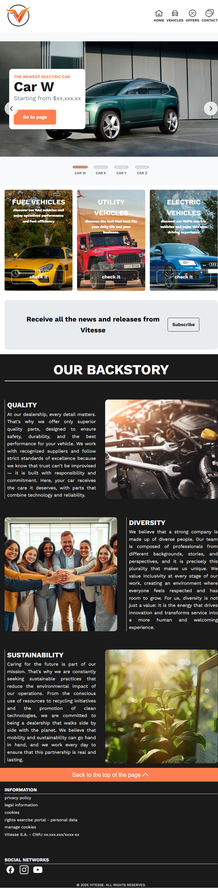
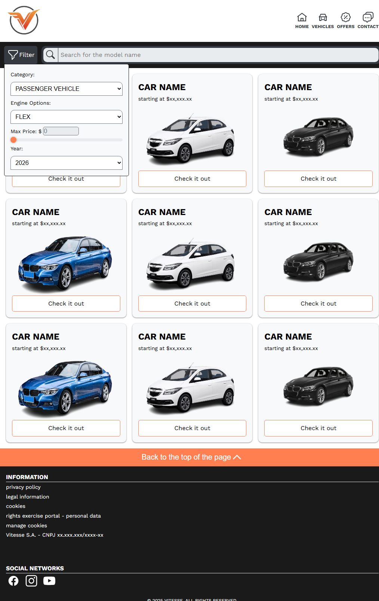
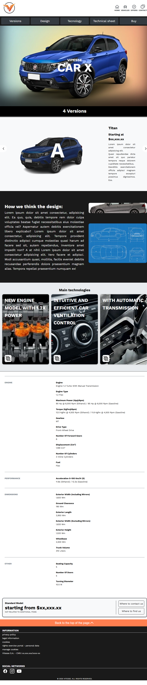

# **Vitesse — Site de Concessionária**

Um site fictício de concessionária de veículos criado para demonstrar domínio dos fundamentos de **HTML, CSS e JavaScript**, com foco em **estrutura limpa, acessibilidade, responsividade e design de interface**.

## Deploy

**GitHub Pages:**
[https://vitesse-dealership](https://drey-1.github.io/vitesse-dealership/)

---

## Sobre o Projeto

**Vitesse** é um site multi-páginas para uma concessionária de carros fictícia.
O objetivo do projeto foi colocar em prática conceitos essenciais de front-end, simulando um produto real do mercado.

Durante o desenvolvimento, o foco foi em:

* HTML semântico e otimizado para SEO
* Layout responsivo (mobile-first)
* Metodologia BEM para organização do CSS
* Interface inspirada em marcas automotivas reais
* Interações utilizando JavaScript puro

O design foi inspirado no site da **Renault**, analisando como o alto contraste, o espaço negativo e a hierarquia visual são usados para destacar o produto principal: o carro.

---

## Páginas do Site

* Home
* Veículos (pesquisa e listagem)
* Detalhes do veículo
* Ofertas
* Concessionárias (mapa)
* Contato

---

## Tecnologias Utilizadas

* **HTML5** — marcação semântica e metadados para SEO
* **CSS3** — BEM, Flexbox, Grid e abordagem mobile-first
* **JavaScript** — manipulação de DOM e funcionalidades interativas

---

## Design System

**Fonte principal**

* Work Sans

**Paleta de cores**

* **Primária (CTA):** `#FF7F50`
* **Escura:** `#1A1A1A`
* **Clara:** `#FFFFFF`
* **Escala de cinzas:**

  * `#F8F9FA`
  * `#E9ECEF`
  * `#6C757D`
  * `#343A40`

---

## Estrutura do Projeto

```
assets/
pages/
scripts/
styles/
index.html
```

---

## O que eu aprendi

* Estruturar um site real de múltiplas páginas
* Aplicar BEM em um projeto de verdade
* Construir layouts responsivos usando Flexbox e Grid
* Separar corretamente responsabilidades entre HTML, CSS e JavaScript
* Criar um design baseado em referências reais do mercado

---

## Screenshots

### Home (Desktop)



### Home (Mobile)


### Listagem de Veículos



### Página do Veículo



---

## Licença

Este projeto foi criado para fins educacionais e para compor portfólio.

---

